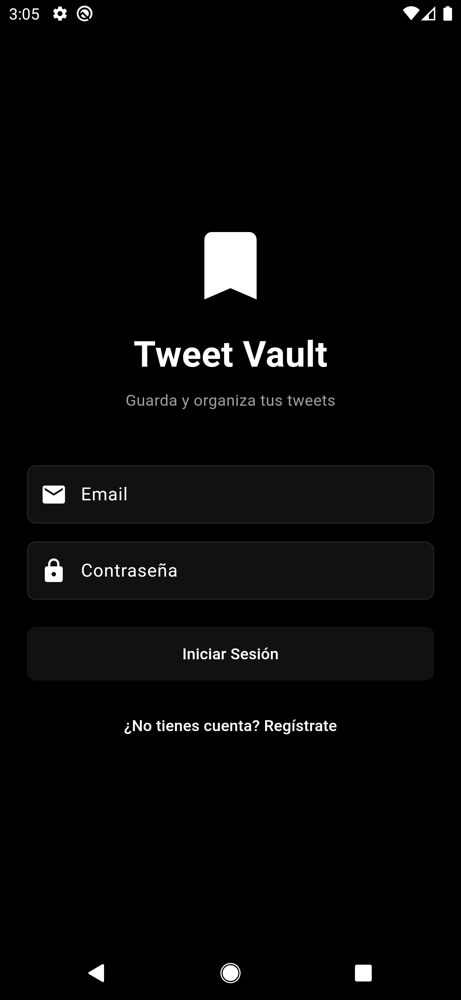
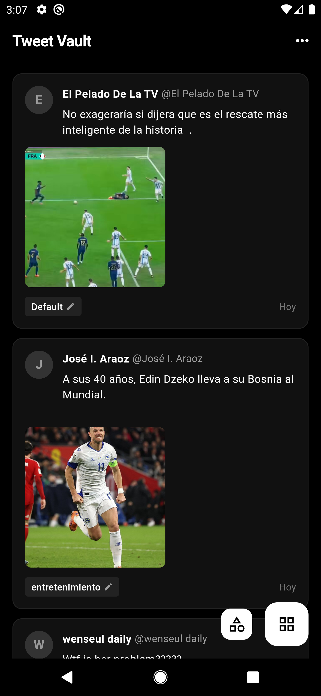
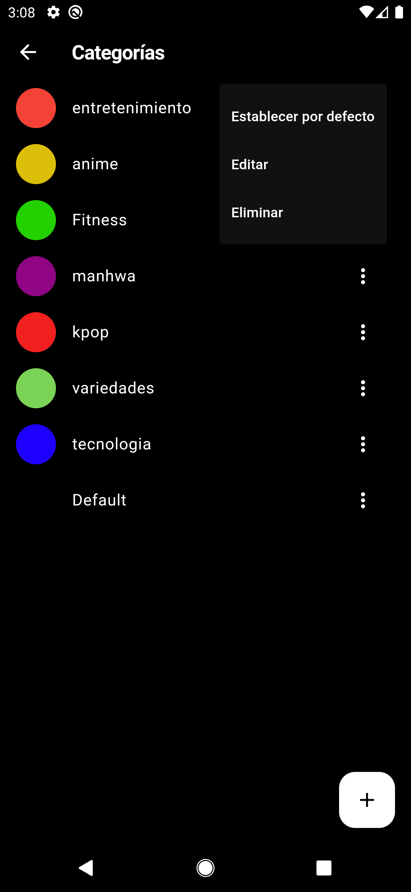

# Tweet Vault App


App móvil para guardar y organizar tweets desde X/Twitter. Comparte tweets desde la app oficial y-guárdalos en categorías.

> **Proyecto relacionado:** [Tweet Vault Chrome Extension](https://github.com/ivanbvb13/tweet-vault) - Extensión de Chrome con la misma funcionalidad.

## Características

- 🔐 **Autenticación** con Supabase (email/password)
- 📁 **Guardar tweets** compartidos desde la app oficial de X/Twitter
- 🏷️ **Categorías** personalizadas con colores
- 🔍 **Búsqueda** por texto o autor
- 🖼️ **Soporte para imágenes** adjuntas
- 📱 **Sincronización** en la nube con Supabase
- 🌙 **Dark theme** minimalista

## Screenshots

| Login | Home | Biblioteca | Categorías |
|-------|------|------------|------------|
|  |  |  |  |

## Requisitos

- Flutter 3.24.3+
- Dart 3.5.3+
- Android SDK
- Proyecto Supabase (ver [Configuración](#configuración))

## Instalación

```bash
# Clonar el repositorio
git clone https://github.com/ivanbvb13/tweet-vault-app.git
cd tweet_vault_app

# Instalar dependencias
flutter pub get

# Configurar credenciales de Supabase (ver sección de configuración)
```

## Configuración

### 1. Crear proyecto en Supabase

1. Ve a [supabase.com](https://supabase.com) y crea un proyecto nuevo
2. Copia la **URL** y **Anon Key** de Project Settings → API

### 2. Configurar base de datos

Ejecuta el siguiente SQL en el SQL Editor de Supabase:

```sql
-- Crear tabla de categorías
CREATE TABLE categories (
  id UUID PRIMARY KEY DEFAULT gen_random_uuid(),
  user_id UUID REFERENCES auth.users(id) ON DELETE CASCADE,
  name TEXT NOT NULL,
  color TEXT NOT NULL DEFAULT '#1DA1F2',
  is_default BOOLEAN DEFAULT FALSE,
  created_at TIMESTAMP WITH TIME ZONE DEFAULT NOW()
);

-- Crear tabla de tweets
CREATE TABLE tweets (
  id UUID PRIMARY KEY DEFAULT gen_random_uuid(),
  user_id UUID REFERENCES auth.users(id) ON DELETE CASCADE,
  tweet_id TEXT NOT NULL,
  url TEXT NOT NULL,
  text TEXT,
  author TEXT,
  handle TEXT,
  published_at TIMESTAMP WITH TIME ZONE,
  saved_at TIMESTAMP WITH TIME ZONE DEFAULT NOW(),
  category_id UUID REFERENCES categories(id) ON DELETE SET NULL,
  images jsonb,
  UNIQUE(user_id, tweet_id)
);

-- Habilitar Row Level Security
ALTER TABLE categories ENABLE ROW LEVEL SECURITY;
ALTER TABLE tweets ENABLE ROW LEVEL SECURITY;

-- Políticas para categorías
CREATE POLICY "users_select_categories" ON categories
  FOR SELECT USING (auth.uid() = user_id);

CREATE POLICY "users_insert_categories" ON categories
  FOR INSERT WITH CHECK (auth.uid() = user_id);

CREATE POLICY "users_update_categories" ON categories
  FOR UPDATE USING (auth.uid() = user_id);

CREATE POLICY "users_delete_categories" ON categories
  FOR DELETE USING (auth.uid() = user_id);

-- Políticas para tweets
CREATE POLICY "users_select_tweets" ON tweets
  FOR SELECT USING (auth.uid() = user_id);

CREATE POLICY "users_insert_tweets" ON tweets
  FOR INSERT WITH CHECK (auth.uid() = user_id);

CREATE POLICY "users_update_tweets" ON tweets
  FOR UPDATE USING (auth.uid() = user_id);

CREATE POLICY "users_delete_tweets" ON tweets
  FOR DELETE USING (auth.uid() = user_id);
```

### 3. Configurar credenciales

1. Copia `supabase_config_base.dart` a `supabase_config.dart`:
   ```
   cp lib/src/2_domain/config/supabase_config_base.dart \
      lib/src/2_domain/config/supabase_config.dart
   ```

2. Edita `supabase_config.dart` con tus credenciales de Supabase:
   ```dart
   class SupabaseConfig {
     static const String url = 'https://tu-proyecto.supabase.co';
     static const String anonKey = 'tu-anon-key';
   }
   ```

**Nota:** `supabase_config.dart` no se sube a GitHub (ya está en `.gitignore`).

### 4. Compartir desde X/Twitter

Para recibir tweets compartidos, configura el intent en Android:

```xml
<!-- android/app/src/main/AndroidManifest.xml -->
<intent-filter>
    <action android:name="android.intent.action.SEND"/>
    <category android:name="android.intent.category.DEFAULT"/>
    <data android:mimeType="text/plain"/>
</intent-filter>
```

## Estructura del Proyecto

```
lib/
├── main.dart
├── locator.dart                    # Inyección de dependencias
└── src/
    ├── 1_presentation/
    │   ├── pages/
    │   │   ├── auth/              # Login, AuthWrapper
    │   │   ├── home/              # Página principal
    │   │   ├── library/          # Biblioteca con búsqueda
    │   │   ├── categories/        # Gestión de categorías
    │   │   └── save_tweet/        # Guardar tweet compartido
    │   ├── shared/                # Widgets reutilizables
    │   └── theme/                # AppTheme (dark theme)
    └── 2_domain/
        ├── config/               # SupabaseConfig
        ├── dto/                   # TweetDto, CategoryDto
        ├── service/              # Interfaces e implementaciones
        └── helpers/              # ShareIntentHandler, etc.
```

## Tech Stack

- **Flutter** 3.24.3
- **Dart** 3.5.3
- **GetX** - Estado y navegación
- **GetIt** - Inyección de dependencias
- **Supabase Flutter** - Backend (auth + base de datos)
- **Cached Network Image** - Cacheo de imágenes

## Comandos útiles

```bash
# Desarrollo
flutter run

# Build debug
flutter build apk --debug

# Build release
flutter build apk --release

# Análisis de código
flutter analyze
```

## Notas

- Los **videos no se pueden guardar** porque X usa URLs temporales `blob:`
- La app usa **dark theme** por defecto
- Los tweets se guardan locally en la base de datos de Supabase
- Compatible con la misma base de datos de la [extensión Chrome](https://github.com/ivanbvb13/tweet-vault)

## Licencia

MIT License - ver archivo [LICENSE](LICENSE) para más detalles.

## Autor

[ivanbvb13](https://github.com/ivanbvb13)
